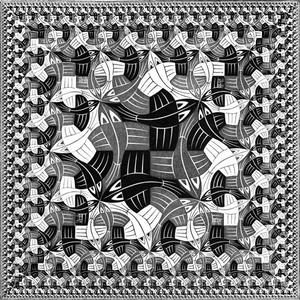

# Ricorsioni di Escher: *The square limit*

Questo repository contiene il notebook python usato per dei seminari o laboratori tenuti nelle seguenti occasioni:

* Talent Days 2024, evento online.
* PiDay 2024, presso il Broletto di Pavia.

### Python Notebook

In questo notebook, si mostra come usare un linguaggio di programmazione molto semplice per **programmare** delle funzioni ricorsive che trasformano immagini semplici in immagini articolate. L'obiettivo finale è di arrivare a scrivere una funzione composta che produce un'immagine simile al [woodcut di Escher](https://www.wikiart.org/en/m-c-escher/square-limit) chiamato **Square Limit**:

| Data | Notebook | Link |
|:-|:-|:-|
|**[2024/03/14]**|*Ricorsioni di Escher*||
|**[2024/03/14]**|*Libreria Python di supporto al notebook*|[escherFish.py](https://github.com/stegua/escher-2k24/blob/main/escherFish.py)|

### Esercizi
| Data | Notebook | Link |
|:-|:-|:-|
|**[2024/04/11]**|*Esercizi*||
|**[2024/04/11]**|*Libreria Python per svolgere gli esercizi*|[tiles.py](https://github.com/stegua/escher-2k24/blob/main/tiles.py)|

### Approfondimenti
Le persone interessate a questo argomento, possono approfondire gli argomenti introdotti in questa lezione, leggendo un articolo di [Functional Geometry](https://eprints.soton.ac.uk/257577/1/funcgeo2.pdf) e provare ad individuare connessioni con argomenti affrontati in altri corsi.

### Contatti
Per segnalare errori o suggerire miglioramenti al notebbok, aprire una pull request su GitHub, o mandare un messaggio a [stegua](https://github.com/stegua).

### Riferimenti
1. Henderson, P., 1982, August. Functional geometry. In Proceedings of the 1982 ACM Symposium on LISP and Functional Programming (pp. 179-187).
2. La libreria [svgpath2mpl](https://github.com/nvictus/svgpath2mpl) è usata nella libreria [escherFish.py](https://github.com/stegua/escher-2k24/blob/main/escherFish.py)
3. La classe Tile, usata sempre nel file [escherFish.py](https://github.com/stegua/escher-2k24/blob/main/escherFish.py) è stata ripresa e riadatta da questo sito [https://github.com/mapio/programming-with-escher/blob/master/notebook.ipynb](https://github.com/mapio/programming-with-escher/blob/master/notebook.ipynb)

 
 
 <b>Ricorsioni grafiche nel mondo di Escher</b> by <a xmlns:cc="http://creativecommons.org/ns#" href="http://mate.unipv.it/gualandi" property="cc:attributionName" rel="cc:attributionURL">Stefano Gualandi</a> is licensed under a <a rel="license" href="http://creativecommons.org/licenses/by/4.0/">Creative Commons Attribution 4.0 International License</a>. Based on a project at <a xmlns:dct="http://purl.org/dc/terms/" href="https://github.com/mathcoding/opt4ds" rel="dct:source">https://github.com/escher-2k24</a>.
